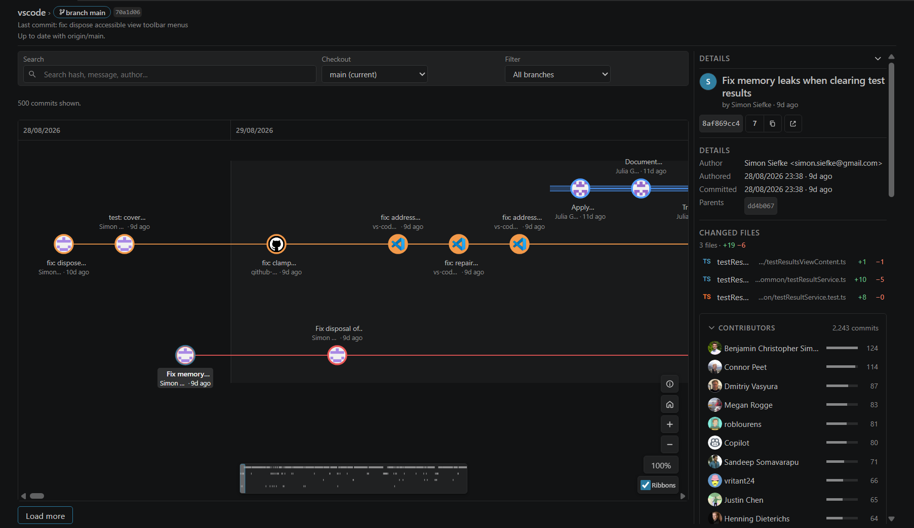
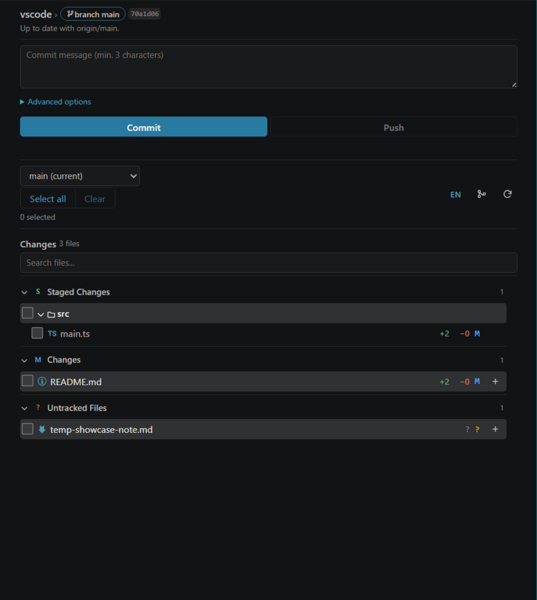

# Git Control

Git Control is an interactive 2D Git DAG graph explorer and source control manager for Visual Studio Code, featuring a dedicated Pending Changes workflow.

Navigate commit histories visually, inspect branches and merge lanes, stage changes granularly, and run standard Git operations directly from a unified interface without relying on terminal commands.

## Overview

Git Control replaces flat vertical commit lists with an interactive two-dimensional Directed Acyclic Graph (DAG) coupled with a dedicated Pending Changes sidebar. The interface is designed for fast navigation, clear visual context, and data safety.

## Key Features

### 1. Interactive 2D Branch Explorer
* **Topological DAG Canvas**: Visualizes branches, merges, tags, HEAD position, and remote synchronization status with deterministic lane allocation.
* **Navigation and Filtering**: Pan, zoom (25% to 400%), search by commit message, hash, or author, and isolate specific branches.
* **Canvas Minimap**: Compact overview map for large repositories.
* **High-Capacity History**: Loads up to 10,000 commits per view with on-demand pagination for older history.

### 2. Dedicated Pending Changes Panel

* **Granular Staging**: Tree and list views for Staged, Unstaged, Untracked, and Conflicted files with batch or individual file selection.
* **Recursive Folder Selection**: Checking a folder toggles all child files automatically.
* **One-Click Commit and Push**: Write commit messages, stage selected items, and optionally push to upstream remotes in a single flow.
* **Inline File Churn**: Displays added and deleted line counts alongside binary and untracked indicators.

### 3. Node Context Menu and Branch Operations
Right-click any commit node or branch ref to perform standard Git actions:
* **Checkout**: Switch branches or checkout specific commits into detached HEAD state.
* **Branch Management**: Create new branches pointing directly to selected commits.
* **Merge Workflows**: Merge target branches into the active branch with visual status tracking.
* **Revert**: Generate standard inverse commits while preserving branch history.
* **Reset**: Choose between Soft Reset (moves HEAD, keeps working changes staged) and Hard Reset.
* **Push Up To**: Fast-forward push repository history up to a selected commit hash.

### 4. Safety Guard and Conflict Resolution
* **Dirty-Tree Protection**: Prevents accidental checkouts, resets, or merges when unstaged or uncommitted changes are present.
* **Two-Stage Destructive Confirmation**: Explicit dual-stage review required before executing irreversible actions like Hard Reset.
* **Remote-Ahead Detection**: Warns when the remote branch contains incoming commits, preventing unintentional non-fast-forward push rejections.
* **Dedicated Conflict Panel**: Lists conflicted files during merge, rebase, or cherry-pick states with quick shortcuts to the VS Code merge editor.

### 5. Commit Inspector and Diff Viewer
* **Detailed Commit Metadata**: Displays author, committer, commit date, hash, and parent commits.
* **Multi-Parent Comparison**: Compare merge commits against any individual parent commit.
* **Integrated Diffing**: Opens files directly in the native VS Code Diff Editor.
* **File Changes Breakdown**: Summarizes changed files and line modifications, including binary file identification.

### 6. GitHub Integration
* **Token Storage**: Connects directly to GitHub via VS Code SecretStorage without exposing credentials.
* **Pull Request Visibility**: Displays pull request statuses and numbers associated with branch heads.
* **External Navigation**: Direct links to view commits and pull requests in the browser.
* **Rate Limit Monitoring**: Real-time indicator for GitHub REST API quotas and cache status.

### 7. Bilingual Interface
* Full interface support for English and Bahasa Indonesia, configurable via settings or the status bar toggle.

## Requirements

* **Visual Studio Code**: Version 1.90.0 or higher.
* **Git CLI**: Git installed and accessible via system `PATH`, or explicitly defined in extension settings.

## Getting Started

1. Open any workspace folder containing a Git repository in Visual Studio Code.
2. Click the **Git Control** icon in the Activity Bar to open the **Pending Changes** view.
3. Open the **Branch Explorer** graph using either:
   * The graph icon on the Source Control panel title bar.
   * Command Palette: `Git Control: Open Explorer`.
4. Stage changes, review commit history, and execute branch operations directly through the interface.

## Extension Settings

Git Control contributes the following settings under `gitControl.*`:

| Setting | Type | Default | Description | Scope |
|---|---|---|---|---|
| `gitControl.gitPath` | string | `""` | Absolute path to the Git executable. When left empty, uses `git` from system PATH. | Machine |
| `gitControl.commitLimit` | number | `10000` | Maximum number of commits loaded into the graph canvas (100 to 10000). | Window |
| `gitControl.pageSize` | number | `500` | Number of commits retrieved per page during historical data fetch. | Window |
| `gitControl.showIgnoredFiles` | boolean | `false` | When enabled, shows gitignored files in the Pending Changes panel. | Window |
| `gitControl.githubApiUrl` | string | `https://api.github.com` | Base URL for GitHub API requests. Customize when connecting to GitHub Enterprise. | Machine |
| `gitControl.fetchStalenessMs` | number | `300000` | Milliseconds after which cached remote status is treated as stale (default: 5 minutes). | Window |
| `gitControl.language` | string (`en` \| `id`) | `en` | Interface display language (`en` for English, `id` for Bahasa Indonesia). | Window |

## Available Commands

Access these commands through the Command Palette (`Ctrl+Shift+P` / `Cmd+Shift+P`):

* `Git Control: Open Explorer`: Opens the interactive 2D Branch Explorer canvas.
* `Git Control: Open Pending Changes`: Focuses the Pending Changes panel in the sidebar.
* `Git Control: Refresh`: Forces an immediate re-fetch and re-render of repository state and history.
* `Git Control: Pick Repository`: Switches active repository focus in multi-root workspaces.
* `Git Control: Connect GitHub`: Securely stores a Personal Access Token to fetch PR details and remote stats.
* `Git Control: Disconnect GitHub`: Clears stored authentication tokens and removes GitHub API linkage.
* `Git Control: Show Logs`: Opens the Git Control output channel to inspect Git execution and diagnostic logs.

## Security Architecture

* **Zero Shell Interpolation**: All Git commands execute via direct process spawning without shell evaluation, preventing command injection vulnerabilities.
* **Token Isolation**: GitHub authentication tokens are stored strictly within VS Code `SecretStorage` and are never serialized to configuration files, state logs, or webview message bridges.
* **Strict Remote Trust Boundary**: Remote endpoints are validated before dispatching authenticated requests, preventing credential leaks to arbitrary hosts.
* **Non-Destructive Defaults**: Force-push operations (such as force push) are intentionally omitted to maintain repository integrity.

## Keyboard Shortcuts in Graph Explorer

| Key | Action |
|---|---|
| `Up` / `Down` | Navigate through commit nodes in the current lane |
| `Left` / `Right` | Move between branch lanes |
| `Enter` | Open selected commit in Inspector |
| `Shift + F10` | Open context menu for selected commit |
| `+` / `-` | Zoom in and zoom out |
| `0` | Reset zoom to 100% |

## License

This project is licensed under the MIT License. See the [LICENSE](LICENSE) file for details.
